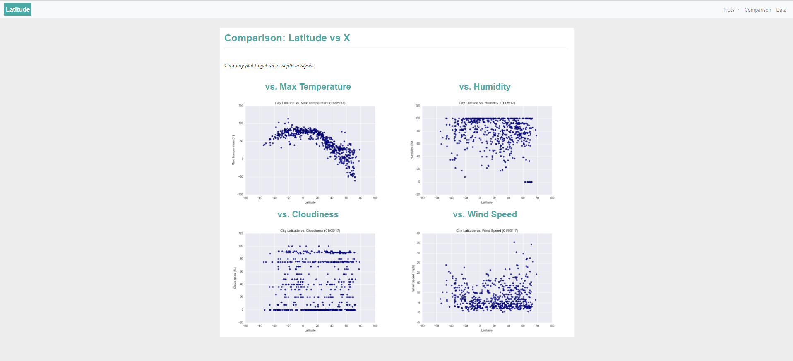

# Web Design Homework - Web Visualization Dashboard (Latitude)
Week 11 - Web-Design-Challenge

HTML and CSS has been applied to create a visualization dashboard website showcasing the analysis completed on weather data.


# Assignment structure
```
Web-Design-Challenge
|__ .gitignore                                # Gitignore file
|__ README.md                                 # Markdown README
|__ WebVisualizations/                        # Contains html, images and resource files
|   |__ Cloudiness.html                       # .html
|   |__ Comparison.html                       # .html
|   |__ Data.html                             # .html
|   |__ Humidity.html                         # .html
|   |__ index.html                            # .html
|   |__ MaxTemperature.html                   # .html
|   |__ style.css                             # .css
|   |__ images/                               # Matplotlib png and page screenshots
|      |__Cloudiness Page.png                 # Screenshot - Page 06 - Full size
|      |__Cloudiness Page-sm.png              # Screenshot - Page 06 - Reduced size
|      |__Cloudiness.png                      # Matplotlib graph
|      |__Comparison Page.png                 # Screenshot - Page 02 - Full size
|      |__Comparison Page-sm.png              # Screenshot - Page 02 - Reduced size
|      |__Data Page.png                       # Screenshot - Page 03 - Full size
|      |__Data Page-sm.png                    # Screenshot - Page 03 - Reduced size
|      |__Humidity Page.png                   # Screenshot - Page 05 - Full size
|      |__Humidity Page.png                   # Screenshot - Page 05 - Reduced size
|      |__Humidity.png                        # Matplotlib graph
|      |__Index Page.png                      # Screenshot - Page 01 - Full size
|      |__Index Page-sm.png                   # Screenshot - Page 01 - Reduced size
|      |__MaxTemperature Page.png             # Screenshot - Page 04 - Full size
|      |__MaxTemperature Page-sm.png          # Screenshot - Page 04 - Reduced size
|      |__MaxTemperature.png                  # Matplotlib graph
|      |__WindSpeed Page.png                  # Screenshot - Page 07 - Full size
|      |__WindSpeed Page-sm.png               # Screenshot - Page 07 - Reduced size
|      |__WindSpeed.png                       # Matplotlib graph
|   |__ Resources/                            # CSV and Jupyter notebook
|      |__cities.csv                          # CSV file for Data table
|      |__csv_to_html.ipynb                   # Jupyter notebook DataFrame.to_html

```


# Usage

```
# Pandas

import pandas as pd

# HTML

<!DOCTYPE html>

<html lang="en">

<script src="https://code.jquery.com/jquery-3.3.1.slim.min.js" integrity="sha384-q8i/X+965DzO0rT7abK41JStQIAqVgRVzpbzo5smXKp4YfRvH+8abtTE1Pi6jizo" crossorigin="anonymous"></script>

<script src="https://cdnjs.cloudflare.com/ajax/libs/popper.js/1.14.7/umd/popper.min.js" integrity="sha384-UO2eT0CpHqdSJQ6hJty5KVphtPhzWj9WO1clHTMGa3JDZwrnQq4sF86dIHNDz0W1" crossorigin="anonymous"></script>
  
<script src="https://stackpath.bootstrapcdn.com/bootstrap/4.3.1/js/bootstrap.min.js" integrity="sha384-JjSmVgyd0p3pXB1rRibZUAYoIIy6OrQ6VrjIEaFf/nJGzIxFDsf4x0xIM+B07jRM" crossorigin="anonymous"></script>

```

# Datasets 

------------------------------------------------------------------------------------------------------------

|No|Source|Link|
|-|-|-|
|1|Cloudiness.html|https://alysnow.github.io/Cloudiness.html|
|2|Comparison.html|https://alysnow.github.io/Comparison.html|
|3|Data.html|https://alysnow.github.io/Data.html|
|4|Humidity.html|https://alysnow.github.io/Humidity.html|
|5|index.html|https://alysnow.github.io/index.html|
|6|MaxTemperature.html|https://alysnow.github.io/MaxTemperature.html|
|7|WindSpeed.html|https://alysnow.github.io/WindSpeed.html|
|8|style.css|https://github.com/alysnow/Web-Design-Challenge/blob/main/WebVisualizations/style.css|
|9|cities.csv|https://github.com/alysnow/Web-Design-Challenge/blob/main/WebVisualizations/Resources/cities.csv|
|10|csv_to_html.ipynb|https://github.com/alysnow/Web-Design-Challenge/blob/main/WebVisualizations/Resources/csv_to_html.ipynb|


# Web Visualization Dashboard Pages

In building this dashboard, individual pages for each plot have been created and a means by which you can navigate between them. There is a totlal of 7 pages. These pages contain the visualizations and their corresponding explanations. A landing home page, a page where you can see a comparison of all of the plots, and another page where you can view the data used to build them in a table. 


## Landing Page:

Landing page contains:

* An explanation of the project.
* Links to each visualizations page. A sidebar containing preview images of each plot, and clicking an image navigates the user to the specific visualization.

### Landing Page: Full size


### Landing Page: Reduced size


## Comparison Page:

Comparison page contains:

* All of the visualizations on the same page so you can easily and visually compare them.

### Comparison Page: Full size



### Comparison Page: Reduced size


## Data Page:

Data page contains:

* A responsive table containing the data used in the visualizations.

### Data Page: Full size


### Data Page: Reduced size


## Visualization Page:

Each Visualization page contains:

* A descriptive title and heading tag.
* The plot/visualization itself for the selected comparison.
* A paragraph describing the plot and its significance.

### Max Temperature: Full size


### Max Temperature: Reduced size


### Humidity: Full size


### Humidity: Reduced size


### Cloudiness: Full size


### Cloudiness: Reduced size


### Wind Speed: Full size


### Wind Speed: Reduced size


# Contributor
- [Alysha Snowden](https://github.com/alysnow)